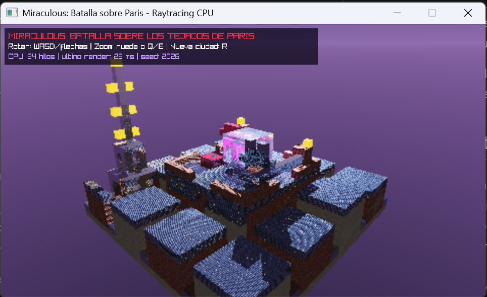
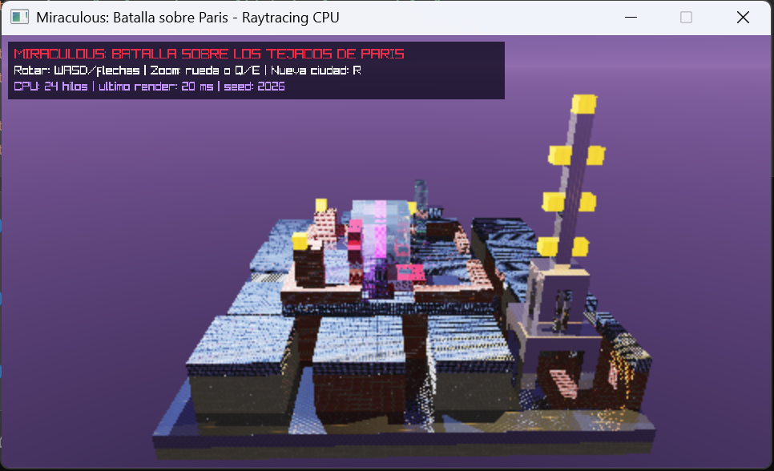
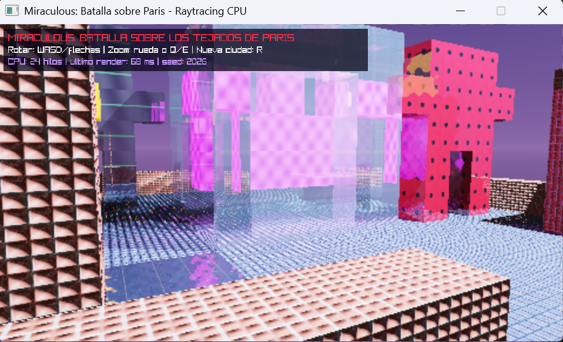
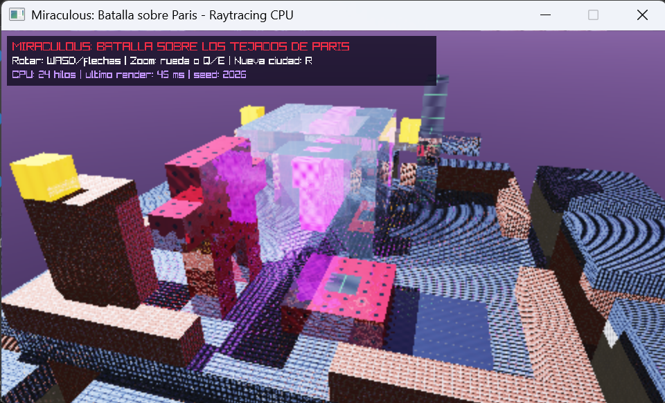
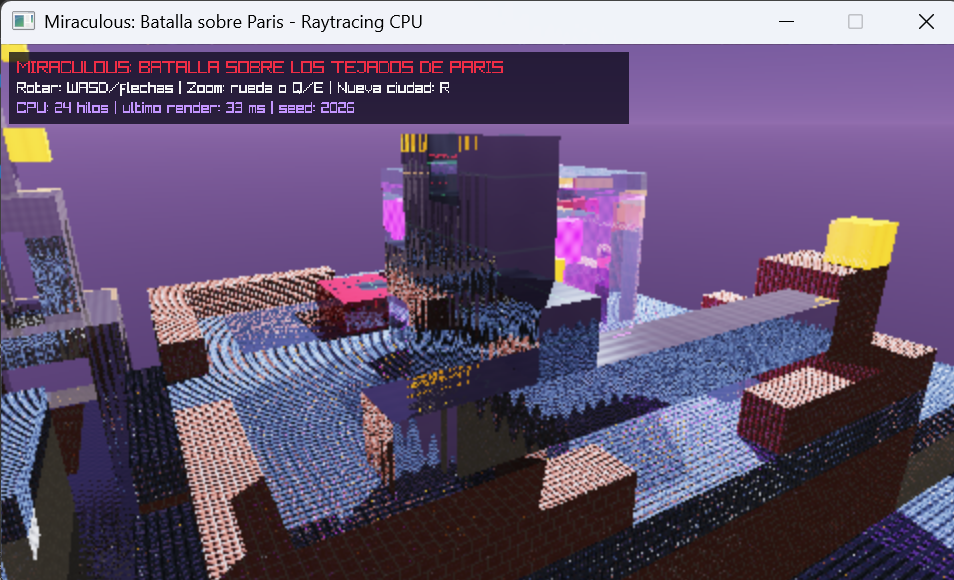
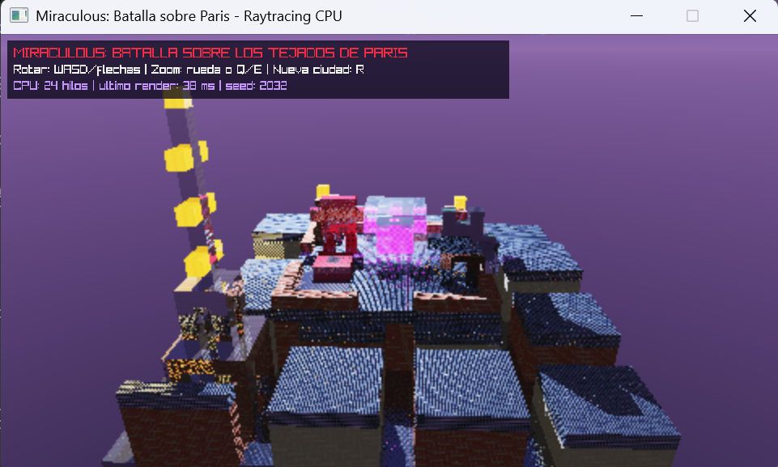

# Miraculous: Batalla sobre los tejados de Paris

Proyecto 2 de Graficas por Computadora: un diorama voxel inspirado en *Miraculous*, renderizado mediante ray tracing en CPU. La escena representa una batalla nocturna entre Ladybug, Cat Noir y un akuma atrapado dentro de una claraboya refractiva.

El motor lanza un rayo por pixel, recorre una rejilla tridimensional mediante DDA y calcula iluminación, sombras, texturas, reflexión, refracción, mapas normales, emisión y skybox sin shaders.

> Proyecto académico inspirado en la serie. No contiene modelos, imágenes, audio ni recursos oficiales; todos los elementos visuales son construcciones voxel y texturas procedurales propias.

## Ejecutar

Requiere Rust estable, Cargo y las herramientas necesarias para compilar Raylib 6.0.0.

```bash
cargo test --lib
cargo run --release
```

## Controles

| Entrada | Acción |
| --- | --- |
| `W/S` o flechas verticales | Rotar verticalmente |
| `A/D` o flechas horizontales | Rotar alrededor de París |
| Rueda o `Q/E` | Acercar/alejar la cámara |
| `R` | Generar otra distribución de edificios |
| `Esc` | Cerrar |

## Elementos de la escena

- Azotea parisina central de 16x16 cubos.
- Ladybug voxel con material rojo y lunares negros.
- Cat Noir voxel con traje negro reflectante, campana y bastón.
- Claraboya de vidrio con índice de refraccion 1.50.
- Akuma violeta emisivo visible a través del vidrio.
- Tejas y charcos reflectantes.
- Chimeneas de ladrillo con mapa normal.
- Torre Eiffel estilizada con metal y luces doradas emisivas.
- Ciudad procedural de 32x32 con calles y edificios variables.
- Skybox nocturno continuo con luna, halo y estrellas.

## Cumplimiento de la rubrica

| Criterio | Implementación | Evidencia recomendada |
| --- | --- | --- |
| Complejidad | Ciudad, azotea, personajes, claraboya, Torre Eiffel y accesorios | Rotación completa de la escena |
| Apariencia | Paleta nocturna azul, roja, negra, dorada y violeta | Vista general desde un ángulo alto |
| Paralelismo | Framebuffer dividido por filas con `std::thread::scope` | Mostrar cantidad de hilos y tiempo en pantalla |
| Rotación y zoom | Cámara orbital interactiva | Rotar y acercarse a los personajes |
| Cinco materiales | Se incluyen diez materiales con texturas y parámetros propios | Acercamientos a cinco superficies distintas |
| Refraccion | Claraboya IOR 1.50 | Ver el akuma deformado a través del vidrio |
| Reflexión | Teja mojada, pavimento, metal y traje de Cat Noir | Buscar reflejos de luna y luces |
| Mapa normal | Ladrillo, piedra y tejas | Mover la cámara cerca de las chimeneas |
| Emisivo | Akuma y luces de la Torre Eiffel | Mostrar que siguen brillando en sombra |
| Skybox | Cielo nocturno con luna y estrellas | Enfocar el horizonte sin objetos |
| Terreno procedural | Ciudad 32x32, alturas por semilla y calles | Presionar `R` y comparar edificios |

La implementación cubre todos los apartados técnicos. Los puntos de complejidad y apariencia son subjetivos, por lo que el vídeo debe hacer visible cada efecto de forma intencional.

## Materiales

| Material | Textura | Specular | Transparencia | Reflectividad | Uso |
| --- | --- | ---: | ---: | ---: | --- |
| Piedra parisina | Bloques suaves | 0.16 | 0.00 | 0.05 | Edificios |
| Ladrillo | Hiladas y mortero | 0.10 | 0.00 | 0.03 | Chimeneas y parapeto |
| Teja mojada | Patrón de tejas | 0.72 | 0.00 | 0.30 | Azotea |
| Vidrio | Bordes claros | 0.92 | 0.82 | 0.10 | Claraboya |
| Ladybug | Rojo con lunares | 0.58 | 0.00 | 0.17 | Ladybug y yo-yo |
| Cat Noir | Negro satinado | 0.86 | 0.00 | 0.34 | Cat Noir |
| Akuma | Remolino violeta | 0.52 | 0.12 | 0.10 | Akuma emisivo |
| Luz de París | Dorado | 0.35 | 0.00 | 0.12 | Torre y faroles |
| Pavimento mojado | Asfalto suave | 0.92 | 0.00 | 0.46 | Calles y charcos |
| Metal | Metal cepillado | 0.94 | 0.00 | 0.62 | Torre y bastón |

## Rendimiento

- Resolución interna: 480x270.
- Escalado bilineal a una ventana de 960x540.
- Intersección voxel mediante DDA.
- Render paralelo con todos los núcleos disponibles.
- La imagen se recalcula solo cuando cambia la cámara o la semilla.
- Cuatro rebotes maximos para reflexion y refraccion.

## Video de demostración

[Ver video del proyecto](demo/Demo_Proyecto2_raytracing.mp4)

## Capturas de funcionamiento

- Primera vista (luego de ejecutar)



- Vista general desde otro punto de vista



- Akuma en la claraboya



- Lado de Ladybug



- Lado de Chat Noir



- Mapa regenerado



## Documentación

- [Arquitectura](docs/ARQUITECTURA.md)

## Autor

Proyecto académico de Alejandra Avilés.